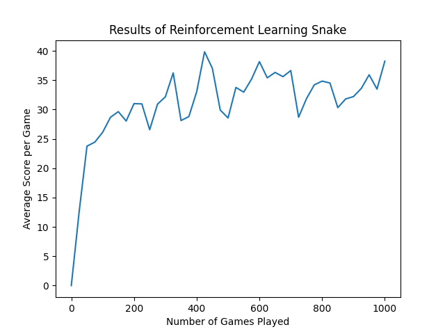

# ReinforcedSnake

## Background
This repository contains an implementation of a reinforcement learning algorithm playing the traditional game Snake. The purpose of this project was to gain experience researching and implementing a machine learning concept. Research for this project was conducted by reading several articles and research papers and looking at implementations of reinforcement learning algorithms for other games.

## Explanation of Algorithm
### State Evaluation
At every tick in the game, the app calculates the state by setting the first 12 bits of an integer. The first 4 bits determine if there is an obstacle(either wall or snake body) in each direction of the snake. The second 4 bits determine the direction of the apple in relation to the head of the snake. The last 4 bits determine the direction that the snake is currently moving. 
### Reward Function
For each tick, the state is either positively rewarded or negatively rewarded. The algorithm is awarded a value of 1 if the snake moves toward the apple and a value of -1 if the snake moves away from the apple. The snake is rewarded a value of 10 if it eats an apple. If the snake dies, the reward value is -100. 
### Mapping of State to Reward Value
The previous state is combined into a tuple with the direction that the snake is moving (this is so that we can predict the result of each choice later on). The tuple is used as the key for a hashmap, with the reward value being added to the total value for that state and direction combination.
### Choosing the Best Move
The best move is calculated by finding the maximum hash value of the current state with the three possible moves (straight, turn left, turn right) as the second part of the tuple. The current configuration of the system has a greedy policy where the algorithm always chooses the best move. A different policy could also be used to allow the snake to take action randomly, which would enable much more exploration of possible states. 

## Results

The algorithm takes a few games to learn how to move toward the apple, around 15-20 games to learn how to avoid hitting the walls, and around 100 games to learn how to avoid hitting its own body. When the algorithm has sufficiently explored all the possible states, it is still able to die because it wraps itself in and runs out of places to move. When the algorithm has played around 800-1000 games, it is much better at avoiding obstacles, but it cannot achieve a higher average score because of this issue. This issue could be resolved by using a more complicated algorithm that can understand when it is being trapped.

